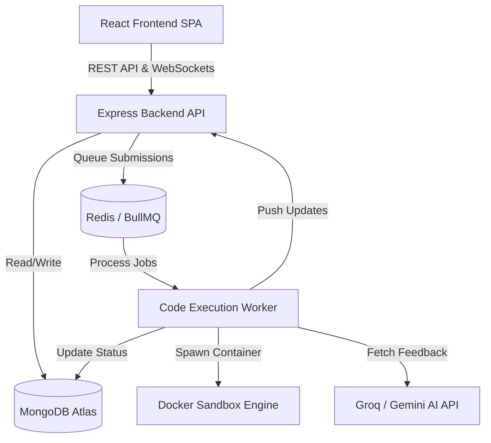

# High-Level Design (HLD) - IntelliJudge

## 1. System Overview
IntelliJudge is a full-stack Online Judge platform designed to evaluate user-submitted code in multiple languages (Python, JavaScript, C++, Java) in a secure, sandboxed environment. It features an integrated AI mentor that provides hints, debugging assistance, and time/space complexity analysis.

## 2. Architecture Diagram

## 3. Core Components

### 3.1. Frontend (Client Tier)
- **Framework:** React (built with Vite)
- **Routing:** React Router DOM
- **Code Editor:** Monaco Editor for rich syntax highlighting and autocomplete.
- **State Management:** React Context API (AuthContext, SocketContext)
- **UI Architecture:** Split-pane layout using `react-resizable-panels`.

### 3.2. Backend (API Tier)
- **Framework:** Node.js with Express
- **Authentication:** JWT (JSON Web Tokens) with Passport.js (supporting OAuth like Google/GitHub).
- **Core Endpoints:**
  - `/api/auth` - User registration, login, and token issuance.
  - `/api/problems` - Serves problem statements, constraints, and public test cases.
  - `/api/submissions` - Receives code, creates a pending submission record, and queues the execution job.
- **Real-time Comm:** Socket.io is utilized to stream execution updates back to the client without long-polling.

### 3.3. Execution Engine (Worker Tier)
- **Message Broker:** Redis & BullMQ handle asynchronous job queuing and concurrency control.
- **Worker Process:** A dedicated Node.js worker (`worker.js`) pulls execution jobs from the queue.
- **Sandbox Environment:** 
  - Code is strictly executed inside isolated Docker containers.
  - Resource limits are rigorously enforced (`--memory`, `--cpus`, `--pids-limit`, `--network none`) to prevent malicious activity, fork bombs, and host system compromise.
  - Standard output (stdout) is captured and compared against the problem's expected hidden outputs.

### 3.4. AI Integration (Mentor Tier)
- **Provider:** Groq SDK / Google Gemini
- **Trigger:** Invoked by the worker engine after code execution evaluates to a final verdict.
- **Function:** Constructs a prompt containing the problem context, user code, and execution verdict. It returns structured Markdown with hints, logical flaw analysis (for WA), runtime exception explanations (for RTE), and complexity metrics.

## 4. Data Flow: Code Submission Lifecycle

1. **Submit:** User writes code in the Monaco Editor and hits Submit.
2. **API Receipt:** The Express API receives the payload, saves a `PENDING` submission in MongoDB, and pushes a Job to the BullMQ Redis queue.
3. **Queue Processing:** The `worker.js` process picks up the job from Redis.
4. **Execution:** 
   - A temporary code file is written to the host filesystem.
   - A Docker container is spawned with the script mounted as a volume.
   - The container runs the code against all test cases.
5. **Evaluation:** The worker compares stdout with expected output and assigns a verdict (AC, WA, TLE, RTE, MLE).
6. **AI Analysis:** The worker asynchronously calls the AI API for code review and feedback.
7. **Resolution:** The final result (Verdict + AI Feedback + Execution Metrics) is updated in MongoDB.
8. **Client Notification:** An HTTP response (or Socket.io event) delivers the results back to the React UI, unlocking the Test Results pane and AI Feedback tab.

## 5. Database Schema (High Level)

### Users Collection
Stores user identity and progress.
- `_id`, `username`, `email`, `passwordHash`, `solvedProblems` (Array of Problem IDs)

### Problems Collection
Stores problem metadata and test cases.
- `_id`, `title`, `description`, `difficulty`, `tags`
- `sampleTestCases` (Visible to user)
- `hiddenTestCases` (Evaluated by Worker only)

### Submissions Collection
Stores the history of code executions.
- `_id`, `userId`, `problemId`, `language`, `code`
- `verdict` (Enum: PENDING, AC, WA, TLE, MLE, RTE)
- `aiFeedback` (Markdown String)
- `executionTime`, `memoryUsed`

## 6. Scalability & Fault Tolerance
- **Stateless Backend:** The Express API is completely stateless (JWT authentication), allowing horizontal scaling behind a load balancer.
- **Worker Scaling:** The BullMQ worker pattern allows the system to easily scale execution capacity by spinning up additional worker nodes connected to the same Redis instance.
- **Failure Recovery:** If a Docker container crashes or hangs, the worker enforces a strict timeout (TLE) and reclaims resources. If the worker process dies, BullMQ automatically re-queues the stalled job to be processed by another worker.
